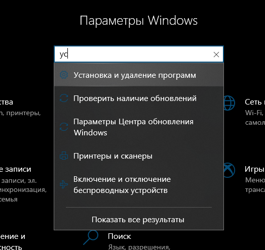

# Создание собственного сервера

### И так начнем самое интересное создание собственных серверов&#x20;

### В начале всего пути мы должны определиться с нашим ядром. В данной ситуации Ядро это наш Minecraft но без графики&#x20;

### Ядер есть большое количество ядер, каждое ядро имеет разные настройки и настройки&#x20;

### В нашем мире создание серверов есть несколько видов ядер&#x20;

* Плагины
* Моды&#x20;
* Плагины + моды&#x20;
* есть еще дата паки но это потом&#x20;

### определимся с ядром&#x20;

### VANILLA это базовое ядро у него нет плагинов и модов это то ядро которое стоит у вас в вашем Minecraft это ядро я возьму в пример про остальные ядра я расскажу в другой главе    &#x20;

&#x20;скачать это ядро можно тут [https://getbukkit.org/download/vanilla](https://getbukkit.org/download/vanilla)  &#x20;

### в нашем мире Minecraft есть много разных версий но в мире серверной части каждому почти каждому ядру нужно своя Java - это такая штучка которая позволяет работать вашему серверу и даже тот Minecraft который стоит у вас на компе работает на Jave только у вас всегда 1 версия, а для серверов нужна Java разных версий&#x20;

### Так ты наверное ни фига не понял короче говоря вы качаете не 1 программу а 2 программы Minecraft и java

### и в данной ситуации ваш Minecraft это маленький ребенок которому нужна помощь для жизни самостоятельно он жить не может а вот java для Minecraft это как родитель который помогает жить в этом мире, java можно назвать костыль или вычислительная машина помогающая Minecraft вычислять действия игрока и обрабатывать всякую информацию, без java ваш сервер Minecraft не заработает&#x20;

### Сервер Minecraft 1.5.2-1.16.5 работает на JDK 8&#x20;

### Сервер Minecraft 1.17 работает на JDK 16&#x20;

### Сервер Minecraft 1.18 и новее работает на JDK 17

### Выше я написал **совмещенность версия** Minecraft и версий  java.

### Для примера я возьму версию 1.16.5 потому что 8Java у вас стоит если вы уже играли в Minecraft, если вы не уверены в то что у вас есть Java это можно проверить вот так&#x20;

.png>)  зайдем в параметры&#x20;

 в поиске пишем (Установка и удаление программ)

.png>)

### И после перехода вы увидите весь ваш список программ на вашем ПК, и вы можете увидеть такой файлик как&#x20;

### ((Java 8 Update 333))&#x20;

### И если все таки ее тут нету то вам надо будет ее скачать&#x20;

Туть - > [https://www.java.com/ru/download/manual.jsp](https://www.java.com/ru/download/manual.jsp)
